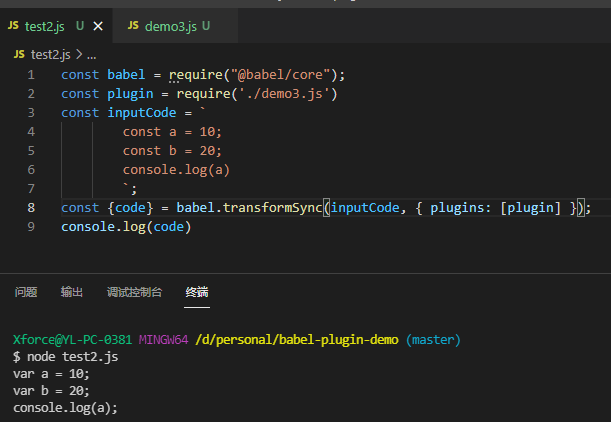
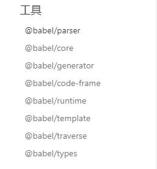
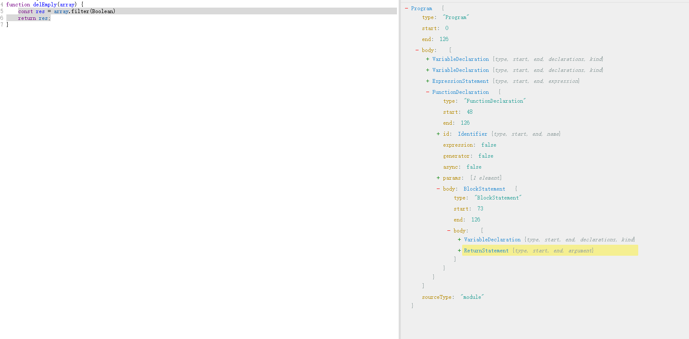

# 使用babel操作AST

## 最简demo




## node、path和visitor

### node
```
function square(n) {
  return n * n;
}
```
这个方法可以表示成
```
{
  type: "FunctionDeclaration",
  id: {
    type: "Identifier",
    name: "square"
  },
  params: [{
    type: "Identifier",
    name: "n"
  }],
  body: {
    type: "BlockStatement",
    body: [{
      type: "ReturnStatement",
      argument: {
        type: "BinaryExpression",
        operator: "*",
        left: {
          type: "Identifier",
          name: "n"
        },
        right: {
          type: "Identifier",
          name: "n"
        }
      }
    }]
  }
}
```
每一层都有相同的结构
```
{
	type:"...",
	start: 0,
  	end: 38,
}
```
这样的每一层结构也被叫做 **节点（Node）**，简单理解，就是ast中的一个节点

### path
将node连接起来的对象
```
{
  "parent": {...},
  "node": {...},
  "hub": {...},
  "contexts": [],
  "data": {},
  "shouldSkip": false,
  "shouldStop": false,
  "removed": false,
  "state": null,
  "opts": null,
  "skipKeys": null,
  "parentPath": null,
  "context": null,
  "container": null,
  "listKey": null,
  "inList": false,
  "parentKey": null,
  "key": null,
  "scope": null,
  "type": null,
  "typeAnnotation": null
}
```
简单理解就是node+增删改查操作

### visitor


<div style="clear:both;"/>


简单理解，visitor下的属性，是AST结构中node的type，这些属性都是function，第一个参数是path，第二个参数是state，包含了文件名、选项等其他信息

## babel的几个常用工具


<div style="clear:both;"/>

### @babel/parser
将代码解析为ast
### @babel/generator
将ast转换为代码
### @babel/types
检查节点类型和构建ast节点
### @babel/traverse
遍历节点
### @babel/template
对于相似的代码块直接使用模版并注入预置好的变量生成即可，不需要每次都书写相同的代码
```
const generator = require("@babel/generator").default;
const template = require("@babel/template").default;
const t = require("babel-types");

const buildRequire = template(`
  var IMPORT_NAME = require(SOURCE);
`);

const ast = buildRequire({
  IMPORT_NAME: t.identifier("myModule"),
  SOURCE: t.stringLiteral("my-module")
});

console.log(generator(ast).code); // var myModule = require("my-module");
```
## 查询和遍历
### 访问

```
export default function({ types: t }) {
  return {
    visitor: {
      BinaryExpression(path) {
        // path.node.xx
        // path.get('body.0')
      }
    }
  };
}
```
### 检查类型：
	通过babel.type检查
```
    t.isIdentifier(path.node.left, { name: "n" })
    // 等价于
	path.node.left != null &&
    path.node.left.type === "Identifier" &&
    path.node.left.name === "n"
```
	通过path检查
```
	path.get('left').isIdentifier({ name: "n" })
```
### 查询父子级
```
path.findParent((path) => path.isObjectExpression());
path.find((path) => path.isObjectExpression());
```
### 查询同级



- 使用`path.inList`来判断路径是否有同级节点，
- 使用`path.getSibling(index)`来获得同级路径,
- 使用 `path.key`获取路径所在容器的索引,
- 使用 `path.container`获取路径的容器（包含所有同级节点的数组）
### 往下遍历
```
path.traverse({
	VariableDeclarator(childPath){}
})
```
### 停止遍历
path.skip()；	//当前节点不再遍历
path.stop();	//退出遍历

## 插入节点
- path.insertBefore
- path.insertAfter
- path.get('body').unshiftContainer
- path.get('body').pushContainer
```
FunctionDeclaration(path) { 	
	path.insertBefore(t.expressionStatement(t.stringLiteral("Because I'm easy come, easy go."))); 

	path.insertAfter(t.expressionStatement(t.stringLiteral("A little high, little low."))); 
}
```

## 替换节点
- path.replaceWith
- path.replaceWithMultiple
```diff
BinaryExpression(path) {
  path.replaceWith(
    t.binaryExpression("**", path.node.left, t.numberLiteral(2))
  );
}
  function square(n) {
-   return n * n;
+   return n ** 2;
  }
```

```diff
+ "Because I'm easy come, easy go.";
  function square(n) {
    return n * n;
  }
+ "A little high, little low.";
```
## 替换节点
path.replaceWith
```
BinaryExpression(path) {
  path.parentPath.replaceWith(
    t.expressionStatement(t.stringLiteral("Anyway the wind blows, doesn't really matter to me, to me."))
  );
}
```
```diff
  function square(n) {
-   return n * n;
+   "Anyway the wind blows, doesn't really matter to me, to me.";
  }
```
## 删除节点
path.remove()
```diff
BinaryExpression(path) {
  path.parentPath.remove();
}
  function square(n) {
-   return n * n;
  }
```

